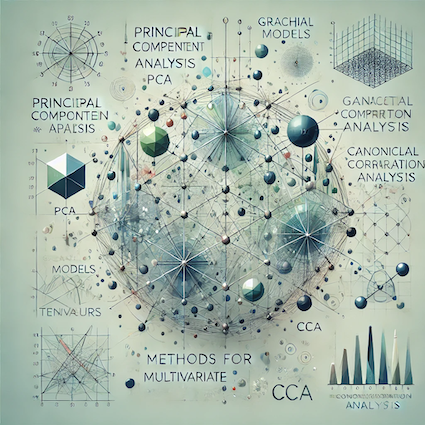

# STA 437/2005  Winter 2025: 
## Methods for Multivariate Data

 This course introduces modern methods for multivariate data building also some theoretical foundations. The lecture is divided into five blocks: I. Foundations of Multivariate Analysis, II. Multivariate statistical Inference, III. Dimensionality Reduction Techniques, IV. Covariance matrix modelling and estimation, V. Methods for Tensors.

More details can be found in [syllabus](syllabus/syllabus.pdf) and [piazza](https://piazza.com/utoronto.ca/winter2025/sta437).

***
***

### Announcements:

- Lectures begin on Jan 8!

***

### Instructors:

| Prof |  [Piotr Zwiernik](https://pzwiernik.github.io/) |
| :--- | :--- |
| Email | piotr.zwiernik@utoronto.ca |
| Office hours | Tuesday, 13:30-15:00 (UY 9033) |

***

### Teaching Assistants:

Miaoshiqi Liu, Peng Liu, Shupeng Chen, Rongqian Zhang, Luis Sierra Muntané
  

***

### Lecture Time & Location:

| Section | Room | Lecture time| 
| --- | --- | --- | 
| STA 437 LEC0101 & STA 2105 LEC0101| BR 200 | W 9-11 (lecture), F 9-10 (tutorials)| 
| STA 437 LEC5101 & STA 2105 LEC5101 | SF 1105 | W 13-15 (lecture), F 13-14 (tutorials)| 

***

### Suggested Reading
[Lecture notes](STA437Notes.pdf) (the file will be expanded and updated as the course progresses so don't print the whole document)

The lecture notes cover all the material presented in class. Some of the textbooks I used:
* (MKB) K.V. Mardia, J.T. Kent, J.M. Bibby (2024) [Multivariate Analysis, 2nd edition](https://www.wiley.com/en-us/Multivariate+Analysis%2C+2nd+Edition-p-9781118738023)
* (ET) Brian Everitt, Torsten Hothorn (2011) [An Introduction to Applied Multivariate Analysis with R]()
* (HH) Susan Holmes, Wolfgang Huber [Modern Statistics for Modern Biology](https://web.stanford.edu/class/bios221/book/)
*	(PRML) Christopher M. Bishop (2006) [Pattern Recognition and Machine Learning](https://www.microsoft.com/en-us/research/people/cmbishop/prml-book/)
***

## Lectures and timeline (provisional)

| Week | Lectures  | Suggested reading | Tutorials | .  | Timeline |
| --- |  --- | --- | --- | --- | --- | 
| 1 | Introduction, some linear algebra, matrix decompositions Random vectors, covariance matrices, sample statistics  | MKB  |  [tut w1]() | NA | [syllabus]() |
| 2 | Multivariate normal distribution: definition, basic properties   Conditional distribution, conditional independence |  | [tut w2]() |  | |
| 3 | Estimation for MVN models   Gaussian Processes: basic definitions and examples   |  | [tut w3]() |  | [hw1 out](#homeworks)  |
| 4 | Non-Gaussian distributions: elliptical distributions, copulas   Non-Gaussian distributions: Gaussian mixtures     |  | [tut w4]()  | | hw1 due |
| 5 | Principal Component Analysis: definition, basic examples    Principal Component Analysis: Scree plot, Computations   |  | [tut w5]()  | | hw1 due |
| 6 |  Uniform Manifold Approximation and Projection (UMAP)   Autoencoders |  | [tut w6]()  | | hw1 due |
| 7 | Reading week   (no class/tutorial)  | - | - | |- | 
| 8 | Midterm exam   |  | - | | midterm |
| 9 | Canonical Correlation Analysis (CCA)  |  | [tut w7]()| | |
| 10 | Graphical models: basic definitions   Gaussian Graphical models | | [tut w8]() | | [hw3 out](#homeworks) |
| 11 | Factor Analysis models |  |   [tut w9]() | |  |
| 12 | Introduction to tensor methods  |  | [tut w10]()  |  | hw3 due |
| 13 | TBA  |  | | |  |

<!--
| 1 | [Introduction   Probabilistic Models](slides/w01/sld01.pdf) | | PML1 1.1-1.3   PML1 3.4, 4.2  |  [tut w1](slides/w01/tut01/tut01.pdf) | [syllabus](syllabus/syllabus.pdf) |
| 2 | [Decision theory   Directed Graphical Models](slides/w02/sld02.pdf) || PRML 1.5   PML2 4.2| [tut w2](slides/w02/tut02.pdf) | |
| 3 | [Markov Random Fields   Exact inference](slides/w03/sld03.pdf) | | PML2 2.3, 4.3   PML2 9.5 | [tut w3](slides/w03/tut03/tut03.pdf) | [hw1 out](#homeworks)  |
| 4 | [Message passing](slides/w04/L4-1.pdf)   [Monte Carlo Methods](slides/w04/L4-2.pdf) |   | PML2 9.3, 9.4   PML2 11.1, 11.2, 11.5 | [tut w4](slides/w04/T4.pdf)   [bonus MP worksheet - tree](slides/w04/L4_sup_Mp_tree.pdf)   [bonus MP worksheet - cycle](slides/w04/L4_sup_Mp_cycle.pdf)| hw1 due |
| 5 | [Sampling I   Sampling II](slides/w05/sld05.pdf) | | PML2 2.6, 12.1-12.6  | [tut w5](slides/w05/tut05.pdf) [j-notebook](slides/w05/tut5.ipynb)| [hw2 out](#homeworks) |
| 6 | [Hidden Markov Models   Variational inference I](slides/w06/sld06.pdf) |  | PML2 9.2   PML2 5.1, | [colab](https://colab.research.google.com/drive/1CZbpGvV54lQmH3-nFlsw1qmPGkBY42kg?usp=sharing) | hw2 due |
| 7 | Reading week   (no class/tutorial) | - | - | - |- | 
| 8 | [Midterm exam](notes/midterm.md) |  | [practice midterm](midterm/prac-mid.pdf)   [solutions](midterm/prac-mid-sols.pdf) | - | midterm |
| 9 | [Variational inference II   EM algorithm](slides/w09/sld09.pdf) |[rec w9](https://play.library.utoronto.ca/watch/4cbf194fe2446fc3e513748cc76b8e72) |[Blei's notes](https://www.cs.princeton.edu/courses/archive/fall11/cos597C/lectures/variational-inference-i.pdf)   PML2 10.1-10.2   PML1 3.5.1, 8.7.2-8.7.3 | [tut w9](slides/w09/Tutorial9.pdf)| |
| 10 | [Probabilistic PCA   Bayesian regression](slides/w10/sld10.pdf) | [rec w10](https://play.library.utoronto.ca/watch/7153bd6cac5cefe01691120748968f3d)| PRML 12.2   PRML 3.3|[tut w10](slides/w10/Probabilistic_PCA_tutorial.ipynb) | [hw3 out](#homeworks) |
| 11 | [Kernel methods   Gaussian processes](slides/w12/sld12.pdf) |[rec w11](https://play.library.utoronto.ca/watch/70f79d046490dd50e484e32cf712c44f) | PRML 6.1-3   PRML 6.4 |[GP tutorial](https://scikit-learn.org/stable/modules/gaussian_process.html)   [tut w11](slides/w12/Kernel_regression.ipynb) |  |
| 12 | [Neural Networks](slides/w11/lec11.pdf) | [rec w12](https://play.library.utoronto.ca/watch/a46f849c286d3d2cff963e1794a078a0) | [notes](slides/w11/nn_notes.pdf) | [NN tutorial](https://colab.research.google.com/drive/1pDBm1RRTFHcs8bmn23fM0Qc8HoTFfdGd?usp=sharing) | hw3 due |
| 13 |  [Diffusion models](./slides/w13/L13-1.pdf)   Final exam review | [rec w13](https://play.library.utoronto.ca/watch/41808a0f0e925ccb1045fa38f2b6ca84) | [more detailed diffusion blog](https://lilianweng.github.io/posts/2021-07-11-diffusion-models) | - |  |
-->

***

## Homeworks

| Homework # | Out | Due | TA Office Hours | Solutions |
| --- | --- | --- | --- | --- |
<!--
|[Assigment 1](https://colab.research.google.com/drive/1wZYgVqb_qEZkHfcsw4EHCW85wVUsVT1s?usp=sharing) |1/22 |2/04 | 1/31 3-4pm, 2/02 11am-12pm, both at Sidney Smith, rooms 621/621A| [solutions](./hw/hw1/STA414_2024_HW1_Answers.pdf)|
|[Assigment 2](https://colab.research.google.com/drive/1CrlCXFbOf18Hj70H6kOlQIXJc1RciC6r?usp=sharing) |2/05 |2/18 |2/13 1-2pm and on 2/16 11am-12pm, both at Sidney Smith, room 621 |[solutions](./hw/hw2/STA414_2024_Assignment_2_Solution.pdf) |
|[Assigment 3](https://colab.research.google.com/drive/139glMCWwqZa8ZnhBm7qwC6H6r538U7r-?usp=sharing) |3/04 |3/24 | 3/18 and 3/19, both 11am-noon in UY 9040 | [solutions](./hw/hw3/STA414_2024_Assignment_3_Solutions.pdf) |
-->

***

## Computing Resources
For the homework assignments, we will use R and Python with libraries such as [NumPy](https://numpy.org/), [SciPy](https://www.scipy.org/), and [scikit-learn](https://scikit-learn.org/stable/). 
